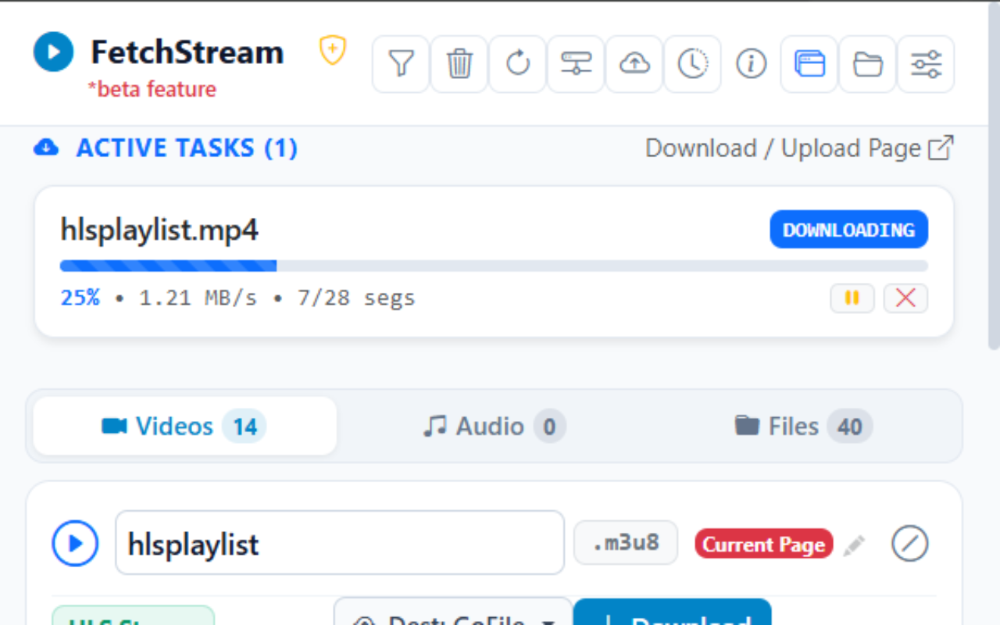
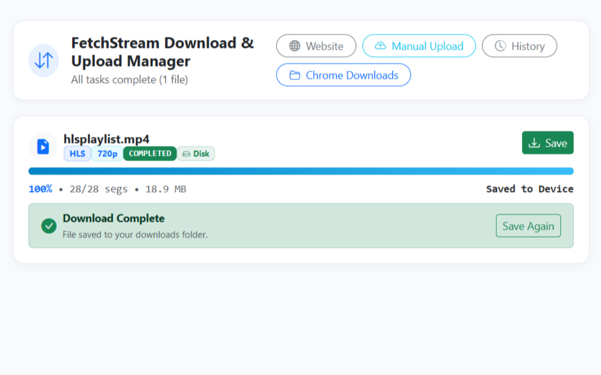
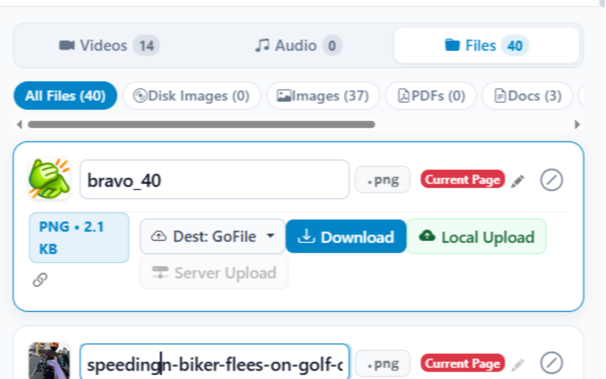
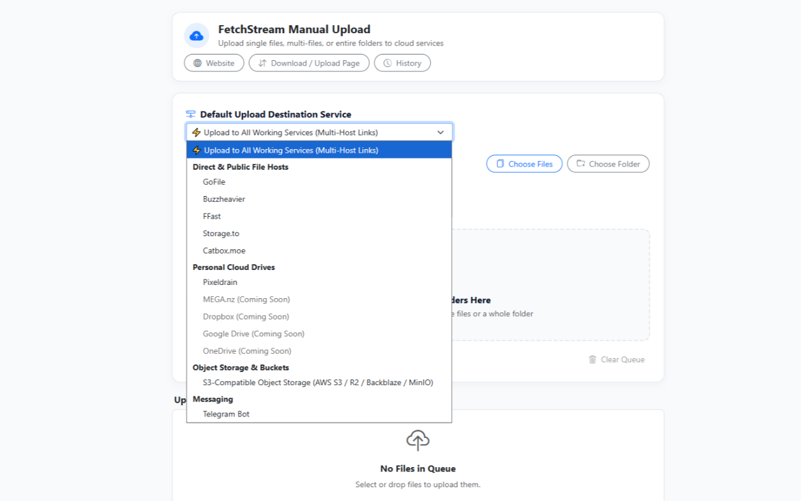
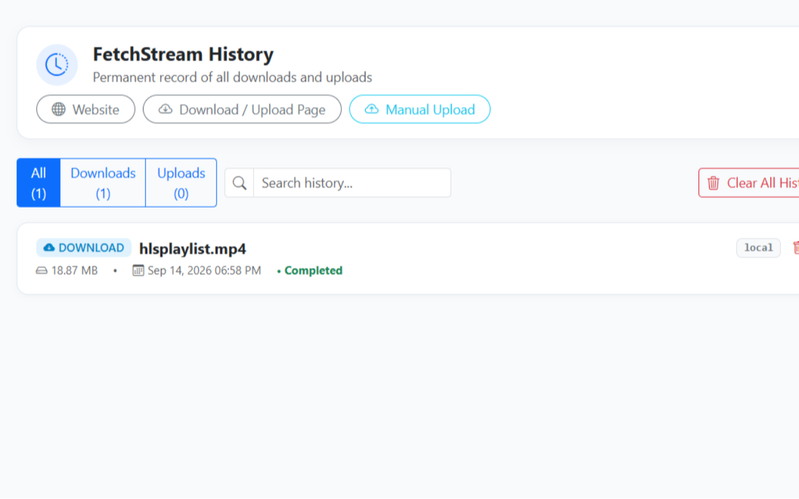
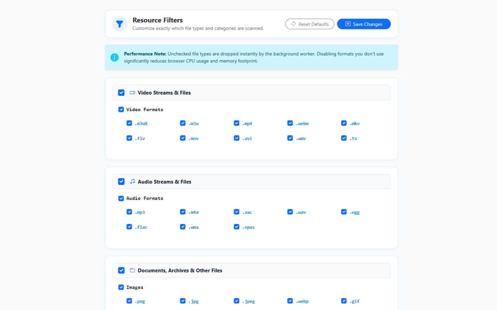
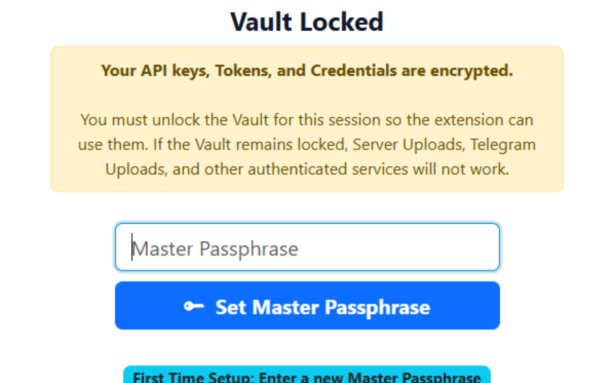

<div align="center">
  

  <h1>FetchStream</h1>
  
  <p><strong>Web media and file inspector, HLS downloader, and optional cloud uploader for Google Chrome (Manifest V3).</strong></p>
  
  <p>
    <a href="https://github.com/Abhishek-banal/fetchstream/releases/latest/download/fetchstream-extension.zip">
      
    </a>
  </p>

  <p>
    🌐 <strong>Website:</strong> <a href="https://fetchstream.in">fetchstream.in</a> &nbsp;|&nbsp;
    📖 <a href="https://fetchstream.in/documentation.html">Documentation &amp; API</a> &nbsp;|&nbsp;
    ❓ <a href="https://fetchstream.in#faq">FAQ</a> &nbsp;|&nbsp;
    📝 <a href="https://fetchstream.in#note">About This Project</a> &nbsp;|&nbsp;
    🔒 <a href="https://fetchstream.in#privacy">Privacy Policy</a>
  </p>
</div>

  [](https://developer.chrome.com/docs/extensions/mv3/intro/)
  [](https://developer.mozilla.org/en-US/docs/Web/JavaScript)
  [](https://getbootstrap.com/)
  [](https://opensource.org)

</div>

---

## Overview

**FetchStream** is a browser extension for detecting, downloading, packaging, and uploading media streams and web files. Core local workflows run in the browser; optional Server Upload uses a runner that you configure.

<div align="center">
  <!-- Row 1 -->
  
  &nbsp;&nbsp;&nbsp;&nbsp;
  
  <br><br>
  
  <!-- Row 2 -->
  
  &nbsp;&nbsp;&nbsp;&nbsp;
  
  <br><br>
  
  <!-- Row 3 -->
  
  &nbsp;&nbsp;&nbsp;&nbsp;
  
  <br><br>

  <!-- Row 4 -->
  
</div>

Built on Chrome's **Manifest V3** platform, FetchStream uses the **Origin Private File System (OPFS)** where available to reduce memory pressure during large downloads. Actual limits depend on the browser, available storage, and the source stream.

---

## ✨ Features

### 1. 🔍 Media Stream Inspection & Detection
- **Adaptive HLS/M3U8 Capture**: Reads and parses `.m3u8` playlists in real time.
- **Resolution & Quality Selector**: Probes master playlists to detect individual video streams (1080p, 720p, 480p, etc.) with resolution badges.
- **Multi-Category Asset Detection**: Categorizes network assets into **Videos**, **Audio**, and **Files** (with dedicated subcategories: **Disk Images** (`.iso`, `.bin`, `.img`, `.dmg`, `.mdf`, etc.), Images, PDFs, Docs, Sheets, Slides, Archives).
- **Separated Audio & Video Multiplexing**: Detects separate audio and video streams for supported media and combines them into a synchronized `.mp4` file in the browser using client-side transmuxing.
- **Embedded PDF Document Export**: Automatically identifies embedded PDF documents on web viewers (such as PDF.js) and exports standard PDF files.
- **Advanced Dynamic Filtering**: Set precise size thresholds (min/max bytes), filter specific file extensions, or block domains. Filters are applied immediately to global history and active streams.
- **SPA Architecture Awareness**: Intelligently hooks into Single Page Applications (like popular video sharing sites) using active URL state verification to prevent old streams from improperly tagging as the current page.
- **Audio Extraction from HLS**: Supports extracting audio tracks (`.m4a`) from compatible `.m3u8` playlists; browser and source compatibility determine the result.
- **Serverless Edge Integrations**: Compatible with standard CI/CD pipelines and edge workers for open-source cloud runners.

### 2. ⚡ High-Speed Stream Downloader
- **OPFS Disk-Backed Storage**: Writes media segments to browser-managed OPFS storage when available, reducing the need to keep the complete file in memory.
- **Multi-Threaded Parallel Fetching**: Downloads media segments concurrently with automatic retry logic.
- **AES-128 Stream Processing**: Built-in WebCrypto-based processing for standard AES-128 HLS streams.
- **Strict MP4 Enforcement**: Transmuxes and outputs all HLS video streams as clean `.mp4` video files.
- **Task Controls**: Real-time progress bars, speed metrics, pause, resume, and cancellation.

### 3. ☁️ Universal Multi-Service Cloud Uploader
Upload detected media or local files directly to leading storage services:
- **Direct File Hosting Providers**:
  - [GoFile.io](https://gofile.io) (Provider-managed file hosting with direct download links)
  - [Buzzheavier.com](https://buzzheavier.com) (Temporary cloud hosting; provider limits apply)
  - [Pixeldrain.com](https://pixeldrain.com) (Cloud file hosting; provider limits apply)
  - [FFast](https://fuckingfast.co) (Chunked upload support; provider limits apply)
  - [Storage.to](https://storage.to) (Direct API upload support; provider limits apply)
  - [Catbox.moe / Litterbox](https://catbox.moe) (Catbox and Litterbox upload support; provider retention limits apply)
- **S3-Compatible & Object Storage**:
  - Works with any S3 API provider: **S3-compatible Storage, Edge Object Storage, Backblaze B2, MinIO, and Hugging Face Buckets** using browser-native Cloud Provider SigV4.
  - Automatically generates 7-day pre-signed download URLs. Requires a standard bucket [CORS Policy](https://fetchstream.in/documentation#s3-cors-setup).
- **Telegram Bot & Channel**:
  - **Bot API**: Uploads to configured channels, groups, or chats subject to Telegram and account limits.
  - **Remote runner integrations**: A configured runner may provide additional Telegram upload methods; those methods and limits are backend-dependent.
  - **Per-Item Captions & Descriptions**: Add custom text descriptions to media cards in the popup so files land in your channel with custom text and native streamable video cards.
- **Combined Cloud Storage + Telegram Relay**:
  - Can upload to S3-compatible storage and pass the result to Telegram when the selected upload path and runner support it.
- **Custom Multi-Host Selection & "Upload to All"**:
  - Choose any combination of destination services via checkboxes (e.g. GoFile + S3 + Telegram) or upload to all working services simultaneously.
  - **Concurrent Processing**: Starts eligible multi-host uploads concurrently and reports results as providers respond.
- **Cloud Runner (Server-Side Upload)**:
  - Sends the stream URL and required request data to a configured remote server, which performs the server-side download and upload. The browser still uses network traffic to communicate with that runner.
  - **Disclaimer:** The serverless and Docker backend examples are reference implementations. Review and secure them before deploying a runner.

### 4. 📦 Batch File & Folder Uploader
- Full-page tab with drag-and-drop batch upload area.
- **Folder Upload & Compression**: Client-side ZIP packaging for folder uploads using advanced OPFS (Origin Private File System) streaming.
- **Memory Management**: Uses OPFS-backed streaming where available to reduce memory use during folder packaging. Browser storage and file-size limits still apply.
- **Per-Item Service Selection**: Assign different upload destinations to different items in the same queue.
- **Queue Controls**: Pause, resume, retry failed/cancelled items, or remove items individually.

### 5. 🕒 History Manager & Dynamic UI
- **Persistent Activity Log**: Local log of downloads and uploads. Filter by downloads, uploads, or search by filename.
- **Dynamic UI Sorting & Sticky Headers**: Easily sort detected media by Newest/Oldest with a dedicated toggle. Category tabs and filters intelligently stick to the top of the window while scrolling through massive lists of captured files.
- Persists across browser sessions until cleared or removed by browser storage management.

### 6. 🔐 Secure AES-GCM Cryptographic Vault
- **Advanced Credential Storage**: To protect your highly sensitive API keys, S3 secrets, and Telegram Bot tokens, FetchStream features a built-in cryptographic Vault.
- **Local Encryption**: All credentials are encrypted directly on your device using WebCrypto **AES-GCM (256-bit)** before being committed to your browser's local storage database.
- **Master Passphrase Protection**: The vault is locked behind a custom master passphrase or passkey. Credentials are decrypted for active operations and session use; protect the browser profile and device as you would any local credential store.
- **Master Passphrase Management**: Easily change your master passphrase at any time without losing your encrypted data.
- **Credential Import / Export**: Safely backup and restore your encrypted vault configuration across different devices or browser profiles.
- **UI / UX**: Responsive popup interfaces with custom-styled Bootstrap dialogs for alerts, confirmations, and security prompts.

---

## Project Structure
```text
fetchstream/
├── .github/workflows/         
├── extension/                 # 🧩 Core extension files
│   ├── manifest.json          # Chrome Extension Manifest V3 configuration
│   ├── service-worker.js      # Background service worker (stream detection, badge, state)
│   ├── *.html                 # Extension UI interfaces (popup, downloader, upload, etc.)
│   ├── bootstrap/             # Embedded Bootstrap 5 CSS, JS, and Icons
│   ├── img/                   # Extension icon assets
│   └── js/                    # Core extension logic and UI controllers
├── screenshots/               # Repository assets (Screenshots for README)
├── server-examples/           # 🚀 Modular Remote Runner Backends & Blueprints
│   ├── docker/                # Option A: Self-hosted Docker & FastAPI runner (VPS/Home Lab)
│   └── serverless/            # Option B: Custom Webhook Cloud Runner (Edge CDN Workers + CI/CD)
├── Config/                   
│   ├── config.json            # Remote configuration file
│   
├
├── .gitattributes             # Git attributes configuration
├── .gitignore                 # Git ignore configuration
├── icon-128.png               # Root icon asset
├── LICENSE                    # MIT License
└── README.md                  # Project documentation
                 
```

## Installation & Setup

### 1. Installing the Chrome Extension
1. Clone or download this repository:
   ```bash
   git clone https://github.com/Abhishek-banal/fetchstream.git
   ```
2. Open Google Chrome (or any Chromium browser such as Brave, Edge, or Opera).
3. Navigate to `chrome://extensions`.
4. Enable **Developer mode** using the toggle in the top right corner.
5. Click **Load unpacked** in the top left corner.
6. Select the `fetchstream` project folder.
7. The **FetchStream** icon will appear in your browser toolbar. Pin it for quick access!

### Updating the Extension Safely
Removing the extension from Chrome can clear its local storage, including History and Vault data. To update to a newer version **without losing your saved settings**, follow these steps:
1. Download the latest `.zip` release and extract it.
2. Open the extracted folder, select **all** the files inside, and copy them.
3. Go to your original installed `fetchstream` folder on your computer and **paste** the files, choosing to **Replace existing files**.
4. Finally, go to `chrome://extensions` in your browser and click the **Reload icon** (circular arrow) on the FetchStream card.
*(Tip: Always keep your installation folder in a safe place, like your C: Drive, so you don't accidentally delete it!)*

---

### 2. Setting Up the Remote Runner (Optional)

FetchStream supports local downloads and local uploads without a remote runner.

If you want **Server-Side cloud downloading** (downloading streams and uploading to cloud hosts entirely on a remote server without using your computer's bandwidth), you can connect the extension to any compatible custom backend runner.

The optional runner communicates through a documented JSON REST API. You can build a compatible server in Python, Node.js, Go, Rust, or another language and deploy it on infrastructure you control.

We provide two **Example Reference Blueprints** to help you get started:

#### Example Blueprint A: Self-Hosted Docker Container (VPS / Local / NAS)
**Note:** *The code blocks provided below and in our documentation are mere examples meant to demonstrate functionality. They are provided as-is and may be prone to error depending on your system configuration. Please review and adjust them before deployment.*

An example reference implementation using FastAPI and Docker. You can use this blueprint to instantly spin up a server on any machine:
```bash
docker compose -f server-examples/docker/docker-compose.yml up -d --build
```
Then enter `http://localhost:8000` (or your domain) in **FetchStream Settings $\to$ Remote Server URL**.

* 📁 **Reference Code & Guide:** [`server-examples/docker/`](server-examples/docker/)

#### Example Blueprint B: Serverless Edge + CI/CD Pipelines
An example reference implementation demonstrating how to build a serverless architecture using an Edge Worker (e.g., Edge CDN Workers, Vercel, Cloud Provider Lambda) coupled with a CI/CD pipeline (e.g., GitLab CI, Cloud Provider CodeBuild).
1. Deploy the example API proxy blueprints from [`server-examples/serverless/`](server-examples/serverless/) to your preferred edge worker.
2. Configure your edge worker to trigger your private CI/CD runner environments using your provider's API.
3. Enter your Edge Worker URL in **FetchStream Settings $\to$ Remote Server URL**.

* 📁 **Reference Blueprints:** [`server-examples/serverless/`](server-examples/serverless/)
* 📖 **Universal REST API Contract:** [server-examples/README.md](server-examples/README.md)

#### 🔒 Securing Your Runner (API Key Protection)
To prevent unauthorized users from discovering or abusing your server URL and bandwidth quota:
1. **On Docker:** Set `API_KEY=your_secret_token` in `server-examples/docker/docker-compose.yml` or `.env`.
2. **On Edge CDN Workers:** Add an encrypted environment variable `API_KEY=your_secret_token` in your Pages project settings.
3. **In the Extension:** Open **Settings (⚙️) ➔ Server-Side Upload**, and paste your secret token into **Server API Key / Token (Optional)**.

When configured, any request without your exact secret key will be rejected immediately with HTTP `401 Unauthorized` before touching compute resources.

---

### 3. Telegram Upload Options & Setup Guide

FetchStream allows you to upload downloaded videos, audios, and files directly to a private Telegram Channel, Group, or Chat.

#### 🤖 Step-by-Step Telegram Setup Guide (Beginners)

1. **Create a Bot via BotFather**:
   - Open Telegram and search for [@BotFather](https://t.me/BotFather) (the official Telegram bot for managing bots).
   - Start a chat and send the command: `/newbot`
   - Enter a display name (e.g. `My Storage Bot`).
   - Enter a unique username ending in `bot` (e.g. `my_media_vault_bot`).
   - BotFather will reply with your **HTTP API Token** (e.g. `7123456789:AAFn73hK...`). Copy this token.

2. **Create a Private Channel & Add the Bot as Admin**:
   - In Telegram, create a new **Channel** (e.g. `My Cloud Vault`) and set it to **Private**.
   - Open **Channel Settings ➔ Administrators ➔ Add Admin**.
   - Search for your newly created bot username and add it.
   - Ensure the permission **"Post Messages"** is enabled so your bot can upload files.

3. **Get Your Channel's Numeric Chat ID**:
   - Post any test message (e.g. "hello") in your newly created channel.
   - Forward that message to a helper bot such as [@JsonDumpBot](https://t.me/JsonDumpBot) or [@userinfobot](https://t.me/userinfobot).
   - The helper bot will return a JSON object. Look for `forward_from_chat`:
     ```json
     "forward_from_chat": {
       "id": -1001234567890,
       "title": "My Cloud Vault",
       "type": "channel"
     }
     ```
   - Copy the numeric `id` value, including the `-100` prefix (e.g. `-1001234567890`).

4. **Save in FetchStream**:
   - Open the FetchStream extension and click **Settings (⚙️)**.
   - Under **Telegram Settings**, enter your **Bot Token** and **Chat ID**.
   - Click outside the panel to save. You can now upload detected media or local files directly to your Telegram channel!

> 💡 **Official Telegram References**:
> * [Telegram Bots: An Introduction for Developers](https://core.telegram.org/bots)
> * [Telegram BotFather Official Tutorial](https://core.telegram.org/bots/tutorial#obtain-your-bot-token)
> * [Telegram Bot API `sendDocument` Specification](https://core.telegram.org/bots/api#senddocument)

> **Note on Third-Party Hosting Limits**: File size limits, bandwidth allowances, and storage retention terms are defined and frequently updated by each respective hosting provider. Please verify current limits directly on their official websites.

---

## Permissions Used

| Permission | Purpose |
| :--- | :--- |
| `storage` | Storing user configuration, credentials, active tasks, and history locally. |
| `unlimitedStorage` | Requesting additional extension storage quota for OPFS-backed media work where Chrome supports it. |
| `webRequest` | Inspecting media playlists and network file requests from active web pages. |
| `webRequestExtraHeaders` | Forwarding stream authentication headers (`Cookie`, `Authorization`, `Referer`) required to download video segments. |
| `declarativeNetRequest` | Handling cross-origin headers required for media stream downloads. |
| `downloads` | Saving completed video, audio, and file binaries to the local file system. |
| `tabs` & `scripting` | Detecting active page context, video elements, and embedded web document viewers. |
| `cookies` | Capturing active playback session cookies solely when you trigger optional Server Upload, allowing your private cloud runner to authenticate stream segments. |
| `host_permissions` (`http://*/*`, `https://*/*`) | Inspecting stream playlists and downloading video segments from any media hosting domain. |

---

## Privacy & Security

- **Local Processing**: Stream inspection, standard AES-128 HLS processing, and local uploads execute in the browser. Server Upload is an explicit optional path.
- **No Telemetry or Tracking**: FetchStream does not bundle tracking pixels, external analytics, or remote logging scripts.
- **Encrypted Local Storage (The Vault)**: API keys and tokens are stored in the extension's local storage and encrypted with **AES-GCM (256-bit)** before persistence. This protects stored values from casual inspection; it does not replace operating-system, browser-profile, or device security. Credentials are not sent to a central FetchStream service.
- **Stream Session Cookies & Authorization Forwarding (Server Upload)**: When using optional Server-Side Upload (Cloud Runner), active session headers—including `Cookie`, `Authorization` tokens, `User-Agent`, and `Referer`—are forwarded directly to your configured remote runner. This allows the remote FFmpeg engine to fetch authenticated stream segments without encountering HTTP `403 Forbidden` errors. **Always use a private runner that you personally operate or trust.**
- **Third-Party Hosting Non-Affiliation**: FetchStream is an independent open-source tool and is not affiliated with, endorsed by, or partnered with GoFile.io, Buzzheavier.com, Pixeldrain.com, Catbox.moe, Telegram, Cloud Provider, Edge Provider, or any other third-party host. FetchStream does not store, host, or moderate any files. All uploads are subject to the independent terms and policies of each provider, and users assume full legal responsibility for their uploaded content.

---

## ⚖️ Legal & Compliance Notice

- **Permitted Use & Personal Archival**: FetchStream is developed solely as a developer utility, network stream analyzer, and personal media archiver. It is designed to assist users in downloading and archiving content they personally own, public domain works, or media for which they hold explicit permission from the copyright owner.
- **DRM Non-Circumvention Policy**: FetchStream does **not** crack, decode, or circumvent Digital Rights Management (DRM) technologies (such as Google Widevine, Apple FairPlay, or Microsoft PlayReady). Streams protected by DRM encryption are unsupported and cannot be downloaded or decoded.
- **Non-Affiliation & Content Liability**: FetchStream is not affiliated with any streaming provider or third-party hosting service. FetchStream does not store, host, or distribute copyrighted materials. Users are solely and independently responsible for complying with applicable international and local copyright legislation and platform terms of service.

---

## License

This project is open source and licensed under the [MIT License](LICENSE).